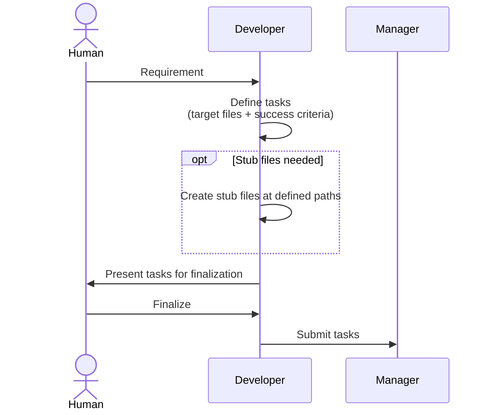
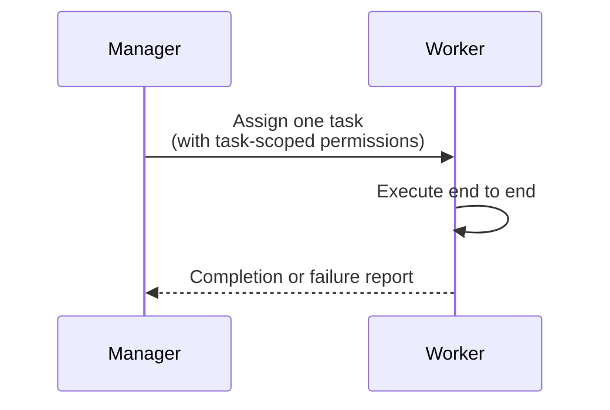
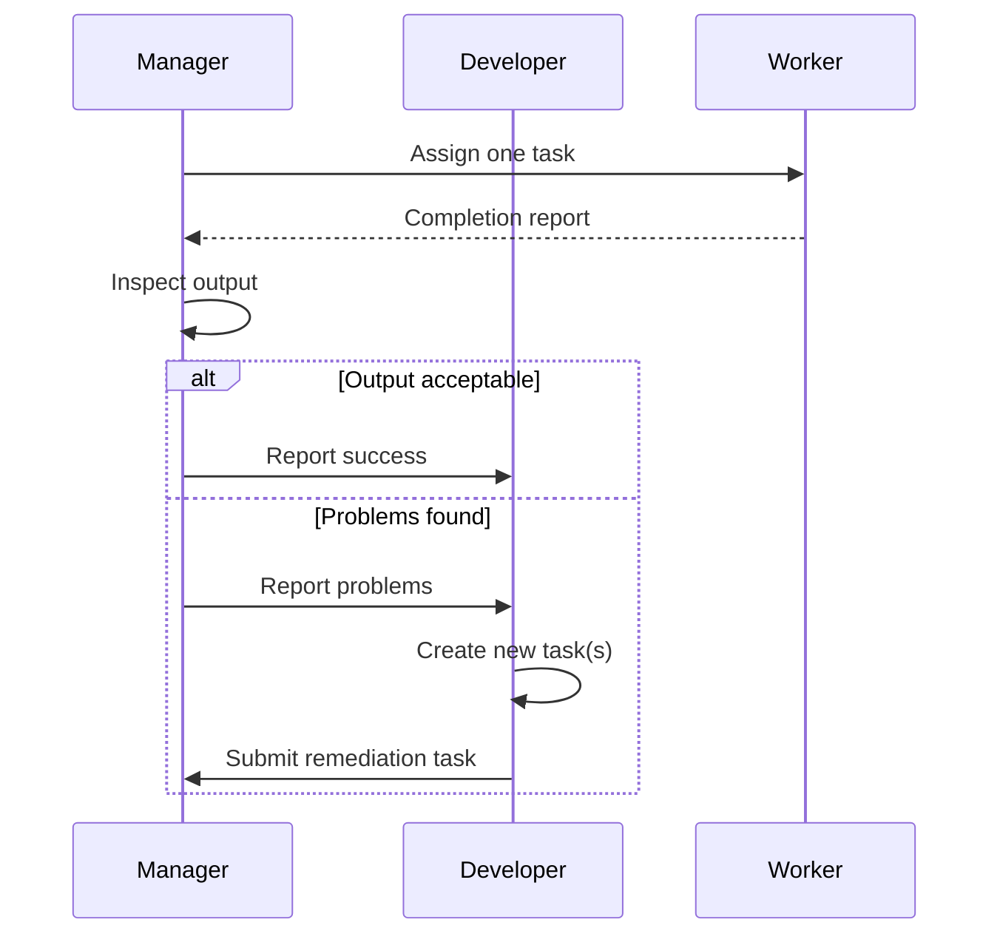

# System Roles

## Purpose

This section documents the architectural roles in the Vajra multi-agent system — their responsibilities, interactions, and constraints.

## Table of Contents

- [Architectural Roles](#architectural-roles)
- [Human](human.md)
- [Developer](developer.md)
- [Manager](manager.md)
- [Worker](worker.md)
- [Agents and Models](#agents-and-models)
- [Role Interactions](#role-interactions)
- [Agent Lifecycle](#agent-lifecycle)

## Architectural Roles

Vajra defines four architectural roles:

| Role | Creates Tasks | Executes Tasks | Orchestrates | Interacts with Human | Agent | Model |
|------|:------------:|:--------------:|:------------:|:--------------------:|:-----:|:-----:|
| Human | No | No | No | — | No | — |
| Developer | Yes | No | No | Yes | **Yes** | Independent |
| Manager | No | No | Yes | Yes | **Yes** | Independent |
| Worker | No | Yes (one at a time) | No | No | **Yes** | Independent |

**Agent** means an LLM-backed instance of the role, and each of the three agents is configured with its own model. The Human holds a role but is not an agent and has no model. See [Agents and Models](#agents-and-models) and [ADR-0010](../adr/0010-every-role-is-an-llm-agent.md).

## Agents and Models

Developer, Manager and Worker are all **agents** — LLM-backed instances of their roles — and each is configured with **its own model**. The Human is the exception: it holds a role, decides, and has no model.

| Role | Agent | Model configuration | Why the model matters |
|------|:-----:|---------------------|----------------------|
| Developer | Yes | Independent | Reads the requirement and the codebase, then decomposes them into testable tasks. Its quality is upstream of everything |
| Manager | Yes | Independent | Inspects completed work against the stated criteria. It is the system's only independent check |
| Worker | Yes | Independent | Executes one task within its scope. Runs concurrently, so its cost is multiplied by the parallelism limit |
| Human | No | — | Decides. The distinction is categorical, not a matter of degree |

Two rules follow from this and hold in every configuration:

- **A model is configuration, not authority.** Selecting a model changes how well a role performs, never what it is permitted to do. A Worker on the strongest available model still may not write outside its task, and a Manager still may not repair the work it rejected.
- **The provider is shared.** All three agents reach the single provider fixed by [ADR-0009](../adr/0009-opencode-zen-is-the-only-provider.md). Per-role configuration selects a *model*, not a vendor. A per-role provider is a separate, undecided question.

The decision, and the costs it accepts — that a run is no longer identified by a single model, and that a deliberately weak Manager model weakens the guarantee in [ADR-0004](../adr/0004-manager-inspects-never-repairs.md) — are in [ADR-0010](../adr/0010-every-role-is-an-llm-agent.md).

## Role Interactions

```
Human ←→ Developer ←→ Manager ←→ Worker
```

- The **Human** talks to the **Developer** and finalizes tasks.
- The **Developer** creates tasks and submits them to the **Manager**.
- The **Manager** assigns tasks to **Workers**, inspects their work, and reports problems back to the **Developer**.
- **Workers** execute one task at a time with permissions confined to that task.

TODO: Add sequence diagrams for common interaction patterns.

### Pattern 1 — Task Definition and Submission

The Human works with the Developer to finalize testable tasks, which are then handed to the Manager as a batch.



### Pattern 2 — Task Execution

The Manager assigns one task to a Worker, which completes it end to end within task-scoped permissions.



### Pattern 3 — Inspection and Escalation

After execution, the Manager inspects the output. Problems are reported to the Developer, which creates new tasks. The Manager never fixes problems directly.



### Interaction Rules

- Workers never communicate with the Human or Developer — all Worker traffic goes through the Manager.
- The Manager never executes or repairs work itself — it inspects and escalates.
- The Developer is the only role that creates tasks, including remediation tasks. See [ADR-0001](../adr/0001-developer-only-task-creation.md).

TODO: Add diagrams for multi-worker parallel execution and blocked-task handling.

## Agent Lifecycle

Covers how each role comes into existence, becomes ready to act, and shuts down.

### Lifecycle Stages

| Stage | Question to answer |
|-------|--------------------|
| Creation | What causes a role to come into existence? |
| Initialization | What state is loaded before it can act? |
| Ready | What makes it eligible to receive work? |
| Active | What is it doing while working? |
| Termination | When and how does it shut down? |

### Constraints From the Role Model

These follow directly from the architectural roles and are already settled:

- A Worker cannot come into existence with pending work — it has no tasks until a Manager assigns one.
- A Worker holds **at most one** active task at any time. See [ADR-0002](../adr/0002-single-task-workers.md).
- A Worker's permissions are provisioned per task, so they must be (re)scoped whenever a new task is assigned.
- The Developer and Manager are long-lived relative to Workers — they span many tasks.
- **A Worker's death is contained to its own task.** A crash, hang, kill, or out-of-memory fails that task and nothing else: the run continues, siblings are untouched, and the pool leases a fresh Worker for the next task. This is what stops untrusted work from destroying work that already succeeded. See [Failure Containment](../tasks/README.md#failure-containment).
- **The Manager spawns Workers but does not decide how many.** Assignment, file locking and admission are deterministic code, and the ceiling is the host's rather than a constant — it falls under load. See [The Manager spawns](../execution/README.md#the-manager-spawns-it-does-not-decide-how-many).

### Open Questions

**Deferred** — these decisions are intentionally unresolved for now and will be settled later. Each one is a live design question, not an oversight.

TODO: What context is loaded into a Worker at initialization — the task description, target files, project state, or prior task history?

TODO: Does a Worker persist across tasks, or is a fresh Worker created per task?

TODO: How is the derived parallelism ceiling surfaced to the Human, so a slow run on a busy machine is not mistaken for a slow harness?

TODO: Are the Developer and Manager singletons, or can multiple exist per session/project?

## See Also

- [Tasks](../tasks/README.md)
- [Execution](../execution/README.md)
- [Communication](../communication/README.md)
- [Agent Specification](../specifications/agent-spec.md)
